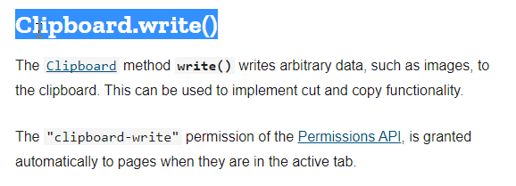

# Copy Text as Link

This is a [Chromium-based browser](#supported-browsers) extension that copies a rich-text link to your clipboard using the selected text on a web page.

The link can be pasted into any rich-text editor. e.g. Outlook, Notion, Word. No need to copy the URL and text separately!

     
     <a href="https://developer.chrome.com/docs/extensions/get-started/tutorial/hello-world#load-unpacked">
     or install from source code
     </a>

## Usage

### Copy text as page link

Copies a rich-text link to the current web page.

1. Highlight some text on a web page.
2. Right-click, and select **Copy text as page link**.
3. Paste the copied text into any [rich-text editor](https://richtexteditor.com/demos/default.aspx).
4. Clicking the link will bring you back to the web page.

### Copy text as fragment link New

Copies a rich-text link to the current text fragment on the web page.

1. Highlight some text on a web page.
2. Right-click, and select **Copy text as fragment link**.
3. Paste the copied text into any [rich-text editor](https://richtexteditor.com/demos/default.aspx).
4. Clicking the link will bring you back to highlighted text fragment on the web page.

### Setting up shortcuts

Both copy methods can be accessed via default keyboard shortcuts which can be modified.

1. Go to your browser extension shortcuts page. e.g.
   - Chrome: [chrome://extensions/shortcuts](chrome://extensions/shortcuts)
   - Edge: [edge://extensions/shortcuts](edge://extensions/shortcuts)
2. Edit the default shortcuts for the **Copy Text as Link** extension.

   | Method                     | Default shortcut       |
   | -------------------------- | ---------------------- |
   | Copy text as page link     | `Ctrl` + `Shift` + `L` |
   | Copy text as fragment link | `Ctrl` + `Shift` + `F` |

### Setting your favorite copy method

The default copy method available in the right-click context menu is **Copy text as page link**. You can change this in the extensions settings.

1. TODO: Go to the extension settings
2. TODO:
3. TODO:
4. TODO:

## Supported browsers

| Browser | Version |
| ------- | ------- |
| Chrome  | TODO    |
| Edge    | TODO    |
| Brave   | TODO    |

## Reference

- [Chrome Context Menu API](https://developer.chrome.com/docs/extensions/reference/api/contextMenus)
