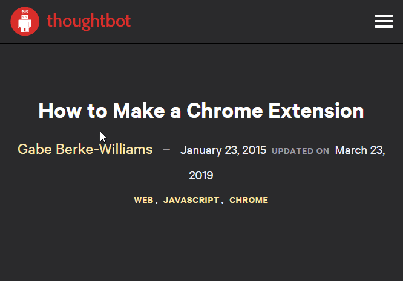

# Copy Text as Link

This is a Chromium browser extension that builds a link using the highlighted text on a web page and the active tabs URL.

The link copied to the clipboard can be pasted into supported rich text editors.

[Download Copy Text as Link from the Chrome Web Store](https://chrome.google.com/webstore/detail/copy-text-as-link/jdhbnbfdhfndpjafikjmbdabogdecenp/related).

## Install

Installation of the extension can be achieved using source control and works with both Google Chrome and the latest version of Microsoft Edge.

- Navigate to `chrome://extensions`.
- Click **Load unpacked**.
- Select and load the `src` folder.

The best way to install the extension is via the Chrome Web Store [here](https://chrome.google.com/webstore/detail/copy-text-as-link/jdhbnbfdhfndpjafikjmbdabogdecenp/related).
